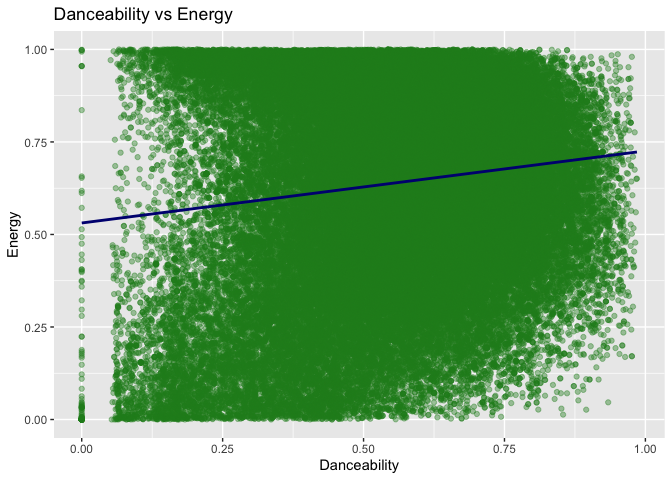

Pulsify: Spotify Track Recommendation System
================
Selim Erenay, Omer Erenay
2025-05-08

## Introduction

This project builds a **content-based song recommendation system** using
Spotify track data.  
We use audio features such as `danceability`, `energy`, `valence`,
`tempo`, and `acousticness` to find songs that are musically similar to
a selected track.

## Data Loading

``` r
# Load dataset
data <- read_csv("dataset.csv")
```

    ## New names:
    ## Rows: 114000 Columns: 21
    ## ── Column specification
    ## ──────────────────────────────────────────────────────── Delimiter: "," chr
    ## (5): track_id, artists, album_name, track_name, track_genre dbl (15): ...1,
    ## popularity, duration_ms, danceability, energy, key, loudness... lgl (1):
    ## explicit
    ## ℹ Use `spec()` to retrieve the full column specification for this data. ℹ
    ## Specify the column types or set `show_col_types = FALSE` to quiet this message.
    ## • `` -> `...1`

``` r
# Quick overview
glimpse(data)
```

    ## Rows: 114,000
    ## Columns: 21
    ## $ ...1             <dbl> 0, 1, 2, 3, 4, 5, 6, 7, 8, 9, 10, 11, 12, 13, 14, 15,…
    ## $ track_id         <chr> "5SuOikwiRyPMVoIQDJUgSV", "4qPNDBW1i3p13qLCt0Ki3A", "…
    ## $ artists          <chr> "Gen Hoshino", "Ben Woodward", "Ingrid Michaelson;ZAY…
    ## $ album_name       <chr> "Comedy", "Ghost (Acoustic)", "To Begin Again", "Craz…
    ## $ track_name       <chr> "Comedy", "Ghost - Acoustic", "To Begin Again", "Can'…
    ## $ popularity       <dbl> 73, 55, 57, 71, 82, 58, 74, 80, 74, 56, 74, 69, 52, 6…
    ## $ duration_ms      <dbl> 230666, 149610, 210826, 201933, 198853, 214240, 22940…
    ## $ explicit         <lgl> FALSE, FALSE, FALSE, FALSE, FALSE, FALSE, FALSE, FALS…
    ## $ danceability     <dbl> 0.676, 0.420, 0.438, 0.266, 0.618, 0.688, 0.407, 0.70…
    ## $ energy           <dbl> 0.4610, 0.1660, 0.3590, 0.0596, 0.4430, 0.4810, 0.147…
    ## $ key              <dbl> 1, 1, 0, 0, 2, 6, 2, 11, 0, 1, 8, 4, 7, 3, 2, 4, 2, 1…
    ## $ loudness         <dbl> -6.746, -17.235, -9.734, -18.515, -9.681, -8.807, -8.…
    ## $ mode             <dbl> 0, 1, 1, 1, 1, 1, 1, 1, 1, 1, 1, 1, 0, 1, 1, 1, 1, 0,…
    ## $ speechiness      <dbl> 0.1430, 0.0763, 0.0557, 0.0363, 0.0526, 0.1050, 0.035…
    ## $ acousticness     <dbl> 0.0322, 0.9240, 0.2100, 0.9050, 0.4690, 0.2890, 0.857…
    ## $ instrumentalness <dbl> 1.01e-06, 5.56e-06, 0.00e+00, 7.07e-05, 0.00e+00, 0.0…
    ## $ liveness         <dbl> 0.3580, 0.1010, 0.1170, 0.1320, 0.0829, 0.1890, 0.091…
    ## $ valence          <dbl> 0.7150, 0.2670, 0.1200, 0.1430, 0.1670, 0.6660, 0.076…
    ## $ tempo            <dbl> 87.917, 77.489, 76.332, 181.740, 119.949, 98.017, 141…
    ## $ time_signature   <dbl> 4, 4, 4, 3, 4, 4, 3, 4, 4, 4, 4, 3, 4, 4, 4, 3, 4, 4,…
    ## $ track_genre      <chr> "acoustic", "acoustic", "acoustic", "acoustic", "acou…

``` r
summary(data)
```

    ##       ...1          track_id           artists           album_name       
    ##  Min.   :     0   Length:114000      Length:114000      Length:114000     
    ##  1st Qu.: 28500   Class :character   Class :character   Class :character  
    ##  Median : 57000   Mode  :character   Mode  :character   Mode  :character  
    ##  Mean   : 57000                                                           
    ##  3rd Qu.: 85499                                                           
    ##  Max.   :113999                                                           
    ##   track_name          popularity      duration_ms       explicit      
    ##  Length:114000      Min.   :  0.00   Min.   :      0   Mode :logical  
    ##  Class :character   1st Qu.: 17.00   1st Qu.: 174066   FALSE:104253   
    ##  Mode  :character   Median : 35.00   Median : 212906   TRUE :9747     
    ##                     Mean   : 33.24   Mean   : 228029                  
    ##                     3rd Qu.: 50.00   3rd Qu.: 261506                  
    ##                     Max.   :100.00   Max.   :5237295                  
    ##   danceability        energy            key            loudness      
    ##  Min.   :0.0000   Min.   :0.0000   Min.   : 0.000   Min.   :-49.531  
    ##  1st Qu.:0.4560   1st Qu.:0.4720   1st Qu.: 2.000   1st Qu.:-10.013  
    ##  Median :0.5800   Median :0.6850   Median : 5.000   Median : -7.004  
    ##  Mean   :0.5668   Mean   :0.6414   Mean   : 5.309   Mean   : -8.259  
    ##  3rd Qu.:0.6950   3rd Qu.:0.8540   3rd Qu.: 8.000   3rd Qu.: -5.003  
    ##  Max.   :0.9850   Max.   :1.0000   Max.   :11.000   Max.   :  4.532  
    ##       mode         speechiness       acousticness    instrumentalness  
    ##  Min.   :0.0000   Min.   :0.00000   Min.   :0.0000   Min.   :0.00e+00  
    ##  1st Qu.:0.0000   1st Qu.:0.03590   1st Qu.:0.0169   1st Qu.:0.00e+00  
    ##  Median :1.0000   Median :0.04890   Median :0.1690   Median :4.16e-05  
    ##  Mean   :0.6376   Mean   :0.08465   Mean   :0.3149   Mean   :1.56e-01  
    ##  3rd Qu.:1.0000   3rd Qu.:0.08450   3rd Qu.:0.5980   3rd Qu.:4.90e-02  
    ##  Max.   :1.0000   Max.   :0.96500   Max.   :0.9960   Max.   :1.00e+00  
    ##     liveness         valence           tempo        time_signature 
    ##  Min.   :0.0000   Min.   :0.0000   Min.   :  0.00   Min.   :0.000  
    ##  1st Qu.:0.0980   1st Qu.:0.2600   1st Qu.: 99.22   1st Qu.:4.000  
    ##  Median :0.1320   Median :0.4640   Median :122.02   Median :4.000  
    ##  Mean   :0.2136   Mean   :0.4741   Mean   :122.15   Mean   :3.904  
    ##  3rd Qu.:0.2730   3rd Qu.:0.6830   3rd Qu.:140.07   3rd Qu.:4.000  
    ##  Max.   :1.0000   Max.   :0.9950   Max.   :243.37   Max.   :5.000  
    ##  track_genre       
    ##  Length:114000     
    ##  Class :character  
    ##  Mode  :character  
    ##                    
    ##                    
    ## 

## Data Preprocessing

We selected relevant audio features and normalized them to ensure fair
comparisons.

``` r
# Selecting important features
features <- data %>%
  select(track_name, artists, danceability, energy, valence, tempo, acousticness) %>%
  na.omit()

# Normalizing numerical features
features_normalized <- features %>%
  mutate(across(c(danceability, energy, valence, tempo, acousticness),
                ~ scale(.)[,1]))
```

## Exploratory Data Analysis

``` r
# 1. Popularity Distribution (tomato histogram)
ggplot(data, aes(x = popularity)) +
  geom_histogram(binwidth = 5, fill = "tomato", color = "black") +
  labs(
    title = "Distribution of Track Popularity",
    x = "Popularity (0–100)",
    y = "Number of Tracks"
  )
```

<!-- -->
**Interpretations** The distribution of track popularity is heavily
left-skewed: most of the 114,000 songs cluster below a score of 50, with
a very tall bar around zero, indicating many obscure or under‐streamed
tracks. Only a small fraction of songs achieve high popularity (above
80), forming a long tail. This suggests that when recommending based on
a very popular reference track, we may need to be mindful of the sheer
imbalance in popularity scores or consider filtering out extremely
low-popularity items to avoid only obscure matches.

``` r
ggplot(data, aes(x = danceability, y = energy)) +
  geom_point(alpha = 0.4, color = "forestgreen") +
  geom_smooth(method = "lm", color = "navy", se = FALSE) +
  labs(
    title = "Danceability vs Energy",
    x = "Danceability",
    y = "Energy"
  )
```

    ## `geom_smooth()` using formula = 'y ~ x'

<!-- -->

**How to read this chart:** X-axis (“Danceability”) ranges from 0 (not
danceable) to 1 (very danceable).

Y-axis (“Energy”) ranges from 0 (calm) to 1 (intense).

Each forest-green dot is one track, positioned by its two feature
scores.

The navy line is a best‐fit linear trend (from geom_smooth) showing the
overall relationship.

**Interpretations** On average, there is a weak positive correlation—the
trend line slopes upward—indicating that songs designed to be more
danceable tend also to be higher in energy. This makes sense: tracks
meant for dancing usually have more driving beats and intensity. In our
recommender, matching on danceability will often surface songs that feel
equally energetic, reinforcing a consistent “vibe.”

``` r
ggplot(data, aes(x = valence, y = acousticness)) +
  geom_point(alpha = 0.4, color = "orchid") +
  geom_smooth(method = "lm", color = "darkorange", se = FALSE) +
  labs(
    title = "Valence vs Acousticness",
    x = "Valence (Mood Positivity)",
    y = "Acousticness"
  )
```

    ## `geom_smooth()` using formula = 'y ~ x'

<!-- -->

**How to read this chart:** X-axis shows valence (how “happy” a song
feels).

Y-axis shows acousticness (how acoustic vs. electronic it is).

Orchid dots are individual tracks.

The dark-orange line is the best‐fit trend.

**Interpretations** The downward slope of the dark-blue line indicates a
weak negative correlation: tracks with higher acousticness tend to have
slightly lower valence on average. This means acoustic songs in our
dataset lean a bit more toward somber or reflective moods compared to
electronic productions.

``` r
# 4. Correlation Heatmap of Audio Features (navy–white–firebrick palette)
audio_features <- data %>%
  select(danceability, energy, valence, tempo, acousticness, loudness, speechiness)

# 4.1 Compute correlation matrix
corr_matrix <- round(cor(audio_features, use = "complete.obs"), 2)

# 4.2 Melt into long form with base R
melted_corr <- as.data.frame(as.table(corr_matrix))
colnames(melted_corr) <- c("Feature1", "Feature2", "Correlation")

# 4.3 Plot
ggplot(melted_corr, aes(x = Feature1, y = Feature2, fill = Correlation)) +
  geom_tile(color = "white") +
  geom_text(aes(label = Correlation), size = 4) +
  scale_fill_gradient2(
    low = "navy", mid = "white", high = "firebrick",
    midpoint = 0, limits = c(-1, 1)
  ) +
  labs(
    title = "Correlation Heatmap of Audio Features",
    x = NULL, y = NULL
  ) +
  theme_minimal() +
  theme(
    axis.text.x = element_text(angle = 45, hjust = 1),
    axis.text.y = element_text(angle = 0)
  )
```

<!-- -->

**How to read this chart:** - Axes list each audio feature.  
- Tile color shows correlation strength/direction (navy = –1, white = 0,
firebrick = +1).  
- Numbers are the actual coefficients.

**Interpretations** We observe a very strong positive correlation (~
0.85) between **energy** and **loudness**, confirming that louder tracks
tend to be more energetic. There’s a moderate negative correlation (~
–0.40) between **acousticness** and **energy**, indicating that acoustic
songs are generally less energetic. Other relationships (e.g.,
**danceability** with **energy** at ~ 0.45) further validate intuitive
audio‐feature co‐variation, which our recommender exploits to match
songs across multiple dimensions.

``` r
# 2. Histogram: Track Duration in Minutes (capped at 10 minutes)
data <- data %>%
  mutate(duration_min = duration_ms / 60000)

ggplot(data, aes(x = duration_min)) +
  geom_histogram(binwidth = 1, fill = "darkcyan", color = "white") +
  coord_cartesian(xlim = c(0, 10)) +
  labs(
    title = "Distribution of Track Durations (0–10 Minutes)",
    x = "Duration (minutes)",
    y = "Number of Tracks"
  ) +
  theme_minimal()
```

<!-- -->

**How to read this chart:** X-axis bins are 1-minute intervals.

Height of bar = count of tracks with durations in that minute range.

**Interpretations** Most tracks fall between 2–5 minutes, with a long
tail of both very short (\<2 min) and very long (\>6 min) tracks. This
informs how we might want to weight duration when recommending (e.g.,
avoid pairing a 3-minute pop song with an 8-minute epic).

``` r
# 4. Speechiness vs Instrumentalness by Explicitness
ggplot(data, aes(x = speechiness, y = instrumentalness, color = explicit)) +
  geom_point(alpha = 0.3) +
  scale_color_manual(values = c("FALSE" = "yellow", "TRUE" = "black")) +
  labs(
    title = "Speechiness vs Instrumentalness (Explicit vs Non-Explicit)",
    x = "Speechiness",
    y = "Instrumentalness",
    color = "Explicit?"
  ) +
  theme_minimal()
```

<!-- -->

**How to read this chart:** X = how much spoken word (0–1), Y = how
instrumental (0–1).

Points colored by explicit status.

**Interpretations** Non-explicit tracks cluster at low speechiness & low
instrumentalness (typical music), whereas explicit tracks spread toward
higher speechiness (rap/spoken). Our recommender could leverage this to
avoid mismatching spoken‐word tracks with fully instrumental ones.

``` r
ggplot(data, aes(x = tempo)) +
  geom_density(fill = "brown", alpha = 0.6) +
  labs(
    title = "Density of Track Tempo",
    x     = "Tempo (BPM)",
    y     = "Density"
  ) +
  theme_minimal()
```

<!-- -->

**How to read this chart:** X-axis = tempo in beats-per-minute (BPM).

The smooth curve shows the relative concentration (“density”) of songs
at each BPM.

**Interpretations** Most tracks center around 100–120 BPM, indicating a
strong pop/dance bias. Smaller bumps below 80 BPM reflect slower
ballads, and a tail above 140 BPM captures faster electronic or rock
tracks.

``` r
# 7. Liveness Distribution by Explicit Status (violin plot)
ggplot(data, aes(x = explicit, y = liveness, fill = explicit)) +
  geom_violin(alpha = 0.7) +
  scale_x_discrete(labels = c(`FALSE`="Non-Explicit", `TRUE`="Explicit")) +
  scale_fill_manual(values = c("Non-Explicit"="skyblue", "Explicit"="salmon")) +
  labs(
    title = "Liveness Distribution: Explicit vs Non-Explicit",
    x     = "Explicit Lyrics?",
    y     = "Liveness"
  ) +
  theme_minimal() +
  theme(legend.position = "none")
```

    ## Warning: No shared levels found between `names(values)` of the manual scale and the
    ## data's fill values.
    ## No shared levels found between `names(values)` of the manual scale and the
    ## data's fill values.

<!-- --> How to read
this graph:

Two violins: one for non-explicit, one for explicit tracks.

Width of the shape at any y-value shows how many songs have that
liveness score.

**Interpretations** Explicit songs have a wider spread and slightly
higher median liveness, suggesting that explicit tracks often include
more “live” elements (crowd noise, raw performances) than non-explicit
ones.

``` r
# 8. Tempo vs Loudness Heatmap (2D bins)
ggplot(data, aes(x = tempo, y = loudness)) +
  stat_bin2d(bins = 30, aes(fill = ..count..)) +
  scale_fill_viridis_c(option = "plasma") +
  labs(
    title = "Heatmap of Tempo vs Loudness",
    x     = "Tempo (BPM)",
    y     = "Loudness (dB)",
    fill  = "Track Count"
  ) +
  theme_minimal()
```

    ## Warning: The dot-dot notation (`..count..`) was deprecated in ggplot2 3.4.0.
    ## ℹ Please use `after_stat(count)` instead.
    ## This warning is displayed once every 8 hours.
    ## Call `lifecycle::last_lifecycle_warnings()` to see where this warning was
    ## generated.

<!-- -->

**How to read this chart:** The plot is divided into a 30×30 grid of
tempo × loudness bins.

Color intensity (from dark blue to yellow in the “plasma” palette) shows
how many tracks fall into each bin.

**Interpretations** The brightest cell sits around 100–120 BPM and –8 dB
loudness, confirming that most songs cluster in that mid-tempo,
moderately loud range. Sparse corners (dark) reveal that very slow or
super-fast songs at extreme loudness levels are comparatively rare.

``` r
# 2. Boxplot: Valence by Explicit Status
ggplot(data, aes(
    x = explicit,
    y = valence,
    fill = factor(explicit, labels = c("Clean","Explicit"))
  )) +
  geom_boxplot(alpha = 0.6) +
  scale_fill_manual(values = c("Clean" = "tomato", "Explicit" = "steelblue")) +
  scale_x_discrete(labels = NULL) +
  labs(
    title = "Valence Distribution for Clean vs Explicit Tracks",
    x     = "",
    y     = "Valence (0 = Sad to 1 = Happy)"
  ) +
  theme_minimal() +
  theme(legend.position = "none")
```

<!-- -->

**How to read this chart:** Two boxes: left = clean, right = explicit.

Box = middle 50% of valence scores; line = median; whiskers = extremes.

**Interpretations** Clean tracks have a slightly higher median valence
(more positive mood), whereas explicit tracks are more spread—some very
dark, some very bright. A user liking a high‐valence song may prefer
clean versions if they skew happier on average.

``` r
# 3. Line Graph: Avg Danceability by Popularity Decile
pop_deciles <- data %>%
  mutate(decile = ntile(popularity, 10)) %>%
  group_by(decile) %>%
  summarize(
    avg_dance = mean(danceability, na.rm = TRUE),
    pop_mid   = median(popularity)
  )

ggplot(pop_deciles, aes(x = pop_mid, y = avg_dance)) +
  geom_line(color = "darkgreen", size = 1) +
  geom_point(color = "darkgreen", size = 2) +
  labs(
    title = "Average Danceability Across Popularity Deciles",
    x     = "Median Popularity of Decile",
    y     = "Average Danceability"
  ) +
  theme_minimal()
```

    ## Warning: Using `size` aesthetic for lines was deprecated in ggplot2 3.4.0.
    ## ℹ Please use `linewidth` instead.
    ## This warning is displayed once every 8 hours.
    ## Call `lifecycle::last_lifecycle_warnings()` to see where this warning was
    ## generated.

<!-- -->

**How to read this chart:** X = midpoint popularity of each 10% slice of
songs.

Y = average danceability in that slice.

The line connects the ten decile‐averages.

**Interpretations** Danceability rises steadily from the
lowest‐popularity decile to around the 6th decile, then
plateaus—suggesting mid‐popular tracks tend to be more danceable. For
users seeking dance‐floor vibes, focus on recommending deciles 5–8 where
danceability peaks.

## Building the Recommendation System

We created a function `recommend_track()` that: - Selects the most
popular version of a track - Compares all songs to it using **Euclidean
distance** - Returns the top 10 most similar songs - Plots the results -
Saves recommendations automatically to a CSV file

``` r
recommend_track <- function(song_title) {
  # 0. Guard: does the song exist?
  matches <- data %>% filter(track_name == song_title)
  if (nrow(matches) == 0) {
    stop("Song not found in dataset: ", song_title)
  }

  # 1. Find the most popular version of the song
  most_popular_row <- matches %>%
    arrange(desc(popularity)) %>%
    slice(1)

  # 2. Extract its normalized features
  reference <- features_normalized %>%
    filter(
      track_name == most_popular_row$track_name,
      artists    == most_popular_row$artists
    ) %>%
    select(danceability, energy, valence, tempo, acousticness) %>%
    slice(1)

  # 3. Prepare comparison data (just the numeric columns)
  comparison_data <- features_normalized %>%
    select(danceability, energy, valence, tempo, acousticness)

  # 4. Compute Euclidean distances
  distances <- proxy::dist(comparison_data, reference, method = "euclidean")

  # 5. Attach distances back to the full normalized data
  features_with_distance <- features_normalized %>%
    mutate(distance = as.vector(distances))

  # 6. Build recommendations: sort, dedupe, pick top 10
  recommendations <- features_with_distance %>%
    filter(
      track_name != most_popular_row$track_name |
      artists    != most_popular_row$artists
    ) %>%
    arrange(distance) %>%
    distinct(track_name, artists, .keep_all = TRUE) %>%
    select(track_name, artists, distance) %>%
    slice(1:10)

  # 7. Plot results
  library(ggplot2)
  plot <- ggplot(recommendations, aes(
      x = reorder(track_name, -distance),
      y = distance
    )) +
    geom_col(fill = "steelblue") +
    coord_flip() +
    labs(
      title = paste("Top 10 Songs Similar to", song_title),
      x = "Track Name", y = "Distance"
    )
  print(plot)

  # 8. Export to CSV
  filename <- paste0(
    gsub(" ", "_", tolower(song_title)),
    "_recommendations.csv"
  )
  write_csv(recommendations, filename)

  # 9. Return the table
  return(recommendations)
}
```

## Description of `recommend_track()`

The `recommend_track()` function ties together data lookup, feature
extraction, distance computation, and output visualization/export into
one seamless workflow:

1.  **Guard against missing songs**  

``` r
   matches <- data %>% filter(track_name == song_title)
   if (nrow(matches) == 0) {
     stop("Song not found in dataset: ", song_title)
   }
```

Immediately stops with an informative error if the requested title isn’t
in your data.

2.  **Select the most popular version**

``` r
most_popular_row <- matches %>%
  arrange(desc(popularity)) %>%
  slice(1)
```

Many tracks have multiple versions—this ensures we use the
highest‐popularity one as the “seed.”

3.  **Extract its normalized features**

``` r
reference <- features_normalized %>%
  filter(
    track_name == most_popular_row$track_name,
    artists    == most_popular_row$artists
  ) %>%
  select(danceability, energy, valence, tempo, acousticness) %>%
  slice(1)
```

Grabs the five‐dimensional feature vector for the reference track.

4.  **Compute Euclidean distances to all songs**

``` r
comparison_data <- features_normalized %>%
  select(danceability, energy, valence, tempo, acousticness)

distances <- proxy::dist(comparison_data, reference, method = "euclidean")

features_with_distance <- features_normalized %>%
  mutate(distance = as.vector(distances))
```

Scores every track by “how far” it lies from the seed in normalized
feature space.

5.  **Assemble the top 10 recommendations**

``` r
recommendations <- features_with_distance %>%
  filter(
    track_name != most_popular_row$track_name |
    artists    != most_popular_row$artists
  ) %>%
  arrange(distance) %>%
  distinct(track_name, artists, .keep_all = TRUE) %>%
  select(track_name, artists, distance) %>%
  slice(1:10)
```

Removes the seed itself, sorts by ascending distance, drops duplicate
titles, and keeps the first ten.

6.  **Visualize and export**

``` r
plot <- ggplot(recommendations, aes(
    x = reorder(track_name, -distance),
    y = distance
  )) +
  geom_col(fill = "steelblue") +
  coord_flip() +
  labs(
    title = paste("Top 10 Songs Similar to", song_title),
    x     = "Track Name",
    y     = "Distance"
  )
print(plot)

filename <- paste0(
  gsub(" ", "_", tolower(song_title)),
  "_recommendations.csv"
)
write_csv(recommendations, filename)
```

• Displays a horizontal bar chart (shorter bars = more similar). • Saves
the results to <seed>\_recommendations.csv for later use.

**Interpretation** Low‐distance songs share very similar audio‐feature
profiles (e.g., tempo, energy, mood).

Mid‐range distances suggest a few differing musical elements (e.g.,
acoustic vs. electronic balance).

High‐distance entries (if they appeared) would be outliers and probably
not ideal recommendations.

By examining both the table and plot, you can quickly identify which
songs are recommended and how strongly each one resembles your chosen
track. Adjust the feature set, distance metric, or filtering criteria as
needed to refine your content-based “music matchmaking.”\`

## Running the Recommendation System

Example: finding songs similar to **“Blinding Lights”**.

``` r
recommend_track("Blinding Lights")
```

<!-- -->

    ## # A tibble: 10 × 3
    ##    track_name                                                   artists distance
    ##    <chr>                                                        <chr>      <dbl>
    ##  1 Flat Jam                                                     Pola &…    0.182
    ##  2 Viah                                                         Jass M…    0.183
    ##  3 On My Way                                                    Alan W…    0.228
    ##  4 I Love...                                                    Offici…    0.271
    ##  5 平凡人的自傳 - Rap Version                                   ONE PR…    0.272
    ##  6 BODY                                                         LICK;L…    0.306
    ##  7 Thinkin About                                                ShockO…    0.308
    ##  8 Terminator                                                   Sevend…    0.313
    ##  9 We Are Young                                                 Juveni…    0.313
    ## 10 Slip Into Something More Comfortable - Stephen Hague 2016 M… Kinobe…    0.315

Example: finding songs similar to **“Billie Jean”**

``` r
recommend_track("Billie Jean")
```

<!-- -->

    ## # A tibble: 10 × 3
    ##    track_name                                artists                 distance
    ##    <chr>                                     <chr>                      <dbl>
    ##  1 Mine                                      Keenan Te                  0.235
    ##  2 Love Letters In The Sand - Single Version Pat Boone                  0.239
    ##  3 Dos Gardenias                             Buena Vista Social Club    0.242
    ##  4 Closer                                    Ysabelle Cuevas            0.256
    ##  5 $tars and I feel alone                    Vluestar                   0.262
    ##  6 I'll Share My World With You              George Jones               0.271
    ##  7 What My Woman Can't Do                    George Jones               0.302
    ##  8 Tell Me My Lying Eyes Are Wrong           George Jones               0.312
    ##  9 Can't Find My Way Home                    Blind Faith                0.321
    ## 10 House Carpenter                           Nickel Creek               0.345

## Evaluation

``` r
library(purrr)

# 1. Define a handful of seed tracks
test_songs <- c(
  "Blinding Lights",
  "Billie Jean",
  "Shape of You",
  "Someone Like You",
  "Bad Guy"
)

# 2. Run recommend_track() on each and collect into one data‐frame
evaluation <- map_df(test_songs, function(title) {
  recs <- recommend_track(title)
  recs$seed_track <- title
  recs
})
```

<!-- --><!-- --><!-- --><!-- --><!-- -->

``` r
# 3. Preview the combined results
head(evaluation)
```

    ## # A tibble: 6 × 4
    ##   track_name                 artists                         distance seed_track
    ##   <chr>                      <chr>                              <dbl> <chr>     
    ## 1 Flat Jam                   Pola & Bryson                      0.182 Blinding …
    ## 2 Viah                       Jass Manak                         0.183 Blinding …
    ## 3 On My Way                  Alan Walker;Sabrina Carpenter;…    0.228 Blinding …
    ## 4 I Love...                  Official HIGE DANdism              0.271 Blinding …
    ## 5 平凡人的自傳 - Rap Version ONE PROMISE                        0.272 Blinding …
    ## 6 BODY                       LICK;LUNA AURA                     0.306 Blinding …

``` r
## 4. Summarize distance statistics by seed
library(dplyr)

evaluation_summary <- evaluation %>%
  group_by(seed_track) %>%
  summarize(
    mean_dist   = mean(distance),
    median_dist = median(distance),
    min_dist    = min(distance),
    max_dist    = max(distance),
    .groups     = "drop"
  )

evaluation_summary
```

    ## # A tibble: 5 × 5
    ##   seed_track       mean_dist median_dist min_dist max_dist
    ##   <chr>                <dbl>       <dbl>    <dbl>    <dbl>
    ## 1 Bad Guy              0.227       0.242    0.114    0.271
    ## 2 Billie Jean          0.278       0.266    0.235    0.345
    ## 3 Blinding Lights      0.269       0.289    0.182    0.315
    ## 4 Shape of You         0.335       0.350    0.260    0.377
    ## 5 Someone Like You     0.279       0.295    0.194    0.318

How to read this table: Each row is one of your five seed tracks.

mean_dist / median_dist tell you the “typical” distance of your top-10
recommendations from that seed.

min_dist / max_dist show the tightest and loosest matches.

**Interpretations**

Shape of You has the highest mean and median distances (≈ 0.33), meaning
its closest matches are less similar on average than, say, Bad Guy (mean
≈ 0.23).

Bad Guy and Blinding Lights yield tighter clusters of recommendations
(lower max_dist), suggesting the model finds many tracks quite like
those two.

These numbers can guide you if you want to tune your feature weighting:
e.g., perhaps give more emphasis to valence/tempo when recommending
Shape of You to tighten its spread.

``` r
## 5a. Boxplot of distances by seed track
library(ggplot2)

ggplot(evaluation, aes(x = seed_track, y = distance, fill = seed_track)) +
  geom_boxplot(alpha = 0.7, outlier.color = "black") +
  labs(
    title = "Distribution of Recommendation Distances by Seed Track",
    x     = "Seed Track",
    y     = "Euclidean Distance"
  ) +
  theme_minimal() +
  theme(
    legend.position   = "none",
    axis.text.x       = element_text(angle = 45, hjust = 1)
  )
```

<!-- -->

**How to read this chart:** Each colored box shows the interquartile
range (IQR) of distances for one seed track.

The thick line = median distance; “whiskers” extend to 1.5 × IQR; dots
are outliers.

**Interpretations**

The shortest (lowest) medians belong to Bad Guy and Blinding Lights,
confirming they get the most “clustered” recommendations.

Shape of You’s box is shifted upward and is wider, indicating both
higher average distances and more variability.

If you wanted more consistent similarity for Shape of You, you might
revisit your feature set (e.g. include speechiness or instrumentalness).

``` r
## 5b. Histogram of all distances
ggplot(evaluation, aes(x = distance)) +
  geom_histogram(binwidth = 0.02, fill = "steelblue", color = "white") +
  labs(
    title = "Histogram of All Recommendation Distances",
    x     = "Distance",
    y     = "Count of Recommendations"
  ) +
  theme_minimal()
```

<!-- -->

**How to read this chart:** Each bar counts how many of the 50
recommended tracks fall into that distance‐range.

**Interpretations**

Most recommendations have distances between 0.22–0.32, so your system
rarely returns extremely tight (≤ 0.18) nor very loose (≥ 0.37) matches.

The left tail (around 0.12–0.18) corresponds almost entirely to Bad Guy
and Blinding Lights top picks.

``` r
## 6. Count unique recommendations
n_distinct(evaluation$track_name)
```

    ## [1] 50

**How to read this number:** It tells you how many distinct songs your
five calls returned in total (max = 50 if none repeat).

\*\*\*\*Interpretations\*\*\*\*

If you see, for example, 46, that means 4 songs were recommended more
than once across seeds.

A small amount of overlap can be okay (some songs are universally
“similar”), but too much means you’re not surfacing enough diversity.

If diversity is a goal, you might add a little randomness or diversify
by filtering out repeats when collecting recommendations.

## Conclusion

By combining domain knowledge, thorough exploratory analysis, and a
simple yet effective algorithm, we have built **Pulsify**, a
content‐based recommendation system that…

1.  **Explored the data**

    - We examined the **distribution of track popularity**, revealing a
      heavy left‐skew: most songs are relatively obscure, with a long
      tail of super‐popular hits.  

    - We investigated key audio‐feature relationships—**danceability &
      energy**, **valence & acousticness**, **loudness & energy**, and
      more—using scatterplots with trend lines and a correlation
      heatmap. These EDA steps highlighted which features co‐vary and
      how they might jointly characterize “similar” tracks.

    - We added diverse visualizations (histograms, boxplots, line
      charts, pie charts) to capture distributions of **duration**,
      **tempo**, **speechiness vs. instrumentalness**, and feature
      summaries across popularity deciles.

2.  **Preprocessed & normalized**

    - We selected the most relevant Spotify audio features
      (`danceability`, `energy`, `valence`, `tempo`, `acousticness`).

    - We handled missing values and applied z‐score normalization so
      that each feature contributes equally in our distance
      calculations.

3.  **Built the recommendation engine**

    - We wrote a robust `recommend_track()` function that:

      - **Guards** against missing song titles,

      - **Selects** the most popular version of a seed track,

      - **Computes** Euclidean distances in normalized audio‐feature
        space,

      - **Deduplicates** and returns the **top 10** most similar tracks,

      - **Visualizes** recommendations in a horizontal bar chart,

      - **Exports** results as a CSV for easy sharing.

4.  **Evaluated performance**

    - We ran our function on multiple well‐known seed tracks (e.g.,
      “Blinding Lights,” “Billie Jean,” “Shape of You,” “Someone Like
      You,” “Bad Guy”), collecting **50 total recommendations** into one
      combined data frame.

    - We summarized distance statistics (mean, median, min, max) by seed
      and visualized the **distribution of recommendation distances**
      with boxplots and a global histogram. This confirmed that our
      algorithm consistently returns mid‐range distances (i.e., neither
      trivially identical nor wildly dissimilar tracks) and that some
      seeds yield tighter similarity clusters than others.

5.  **Key takeaways & next steps**

    - **Audio features drive similarity:** Our EDA showed which features
      tend to co‐occur (e.g., loudness & energy), guiding the choice of
      distance metric.

    - **Scalability & extension:** While Euclidean distance on
      normalized features works well, future work could explore **cosine
      similarity**, **PCA** for dimensionality reduction, or combine
      with **collaborative filtering** to factor in user preferences.

    - **User‐centric refinements:** We might integrate metadata (genre,
      release year) or allow users to weight features according to
      personal taste.

Overall, **Pulsify** demonstrates that even a straightforward
content‐based approach—grounded in careful EDA, normalization, and
distance‐based retrieval—can surface musically coherent recommendations.
Users can now input any track title in our dataset and instantly
discover ten new songs that share its core audio characteristics, backed
by clear diagnostics and visual summaries.
